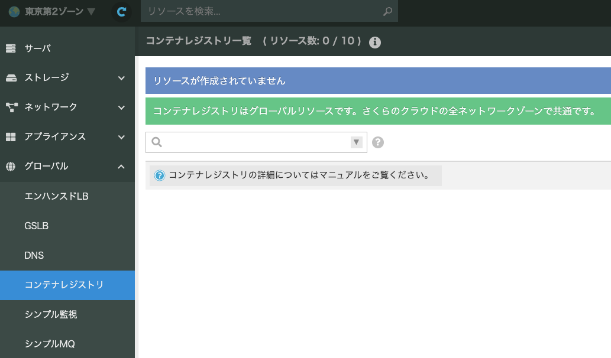
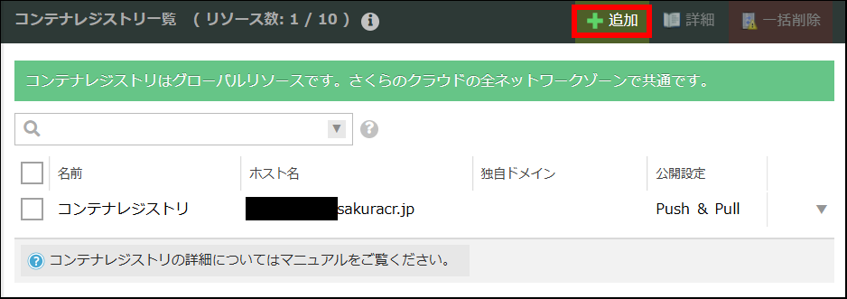
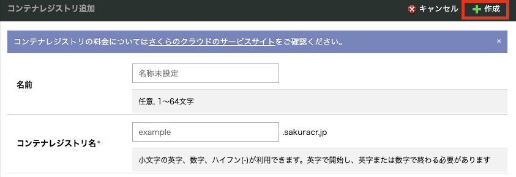
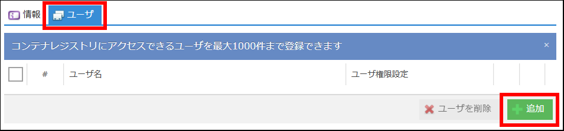
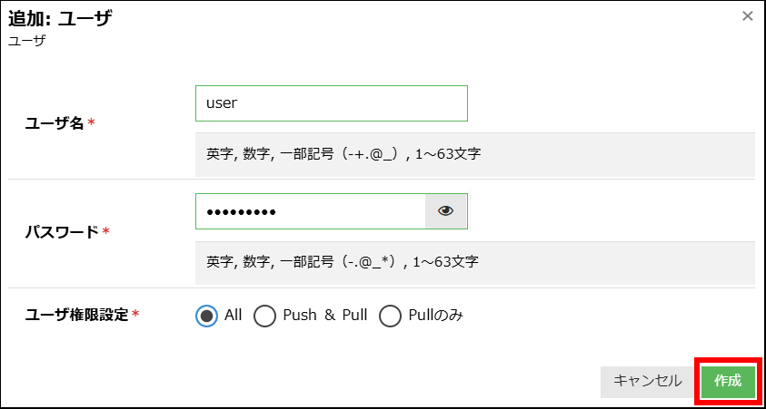
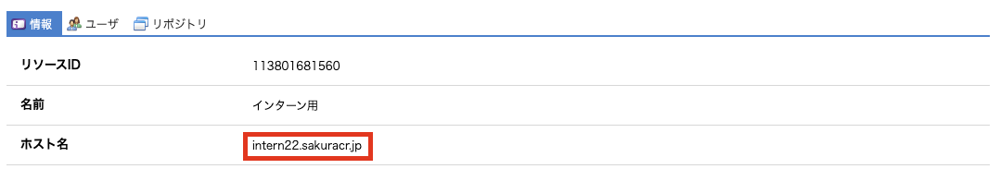

<style>
section::after {
  content: attr(data-marpit-pagination) " / " attr(data-marpit-pagination-total);
}
</style>

<!-- paginate: true -->

# Docker イメージのビルドとコンテナレジストリへの Push

- イメージのビルドにはDockerが使える環境が必要です
1. Dockerの導入手順について
2. コンテナレジストリの使い方について
3. コンテナレジストリへのPush


---

# Dockerの導入手順

- すでに利用できる方はしばらくお待ちください！

---

## Ubuntuでの導入手順

```bash
curl -fsSL https://get.docker.com -o get-docker.sh
sudo sh get-docker.sh

# sudoなしで使えるようにする
sudo gpasswd -a ubuntu docker
newgrp docker
```

---
- インストール後に使えるか確認
  - バージョンはそれぞれバラバラでOKです！
```bash
ubuntu@test-2:~$ docker --version
Docker version 29.7.1, build e9452d6

ubuntu@test-2:~$ docker buildx version
github.com/docker/buildx v0.36.0 df28b0a0b6a44453a87bd53c438432f4120962c9

ubuntu@test-2:~$ docker compose version
Docker Compose version v5.3.1
```

```bash
# テスト起動
ubuntu@test-2:~$ docker run hello-world
Hello from Docker!
This message shows that your installation appears to be working correctly.
...
```

---

## Macでの導入手順

---

### Docker CLIの導入

- CLIツールをまずは入れます
```bash
brew install docker docker-compose docker-buildx
```


```bash
# コマンドが使えるか確認
~ % docker --version
Docker version 28.2.2, build e6534b4eb7

~ % docker buildx version
github.com/docker/buildx v0.36.0 Homebrew

~ % docker compose version
Docker Compose version v2.36.2
```

---

- buildxのコマンドが使えない場合
```bash
mkdir -p ~/.docker/cli-plugins

ln -sf $(which docker-buildx) ~/.docker/cli-plugins/docker-buildx

# 確認
docker buildx version
```
---

### Colimaの導入

```bash
brew install colima
```

```bash
$ colima --version
colima version 0.10.3
```

---

- 起動（数分かかるかもです）
```bash
# ディスクの余裕がない場合は --disk 30 を足してください
colima start --runtime docker --memory 4 --cpu 4
```
```bash
# 確認 (結果例の実行環境はApple Siliconです)
$ colima status
INFO[0000] colima is running using macOS Virtualization.Framework 
INFO[0000] arch: aarch64                           
INFO[0000] runtime: docker                              
INFO[0000] mountType: virtiofs  
```

---

### テスト起動

```bash
docker run hello-world
```

### 実行できない場合

- contextでcolimaが利用されていないかもしれないです
```bash
$ docker context ls
...
colima *   colima    
```

- colimaが利用されていない場合は以下を実行してみてください

```bash
docker context use colima
```

---

ということで本題に戻ってコンテナレジストリを使っていきましょう :raised_hands:

---

## コンテナレジストリの作成

「コンテナレジストリ」はDockerなどのコンテナエンジンが扱うイメージファイルを保管するレジストリ機能をさくらのクラウド上で提供するサービスです。

- コントロールパネル上からレジストリの作成・管理が可能
- 利用方法に応じたアクセス設定が可能

---

### さくらのクラウドからコンテナレジストリを選択

- さくらのクラウドホームから「さくらのクラウド」を選択し、
グローバルのコンテナレジストリを選択します



---

### レジストリの追加

- 新規にレジストリを作成する場合は「追加」をクリックします



---

### 必要項目の入力

- ゾーンの新規作成画面が表示されるので必要な項目を選択・入力します
  - 以下の内容で作成します
    - コンテナレジストリ名: <わかりやすい名前>
  - 他ユーザーが作成済みの名前は使用できないため注意
  - レジストリのホスト名は`<コンテナレジストリ名>.sakuracr.jp`となります



---

### ユーザーの追加

- あらかじめユーザ作成が必要のため、対象のコンテナレジストリを選択し、「ユーザー」をクリックします
- 新しくユーザを作成するため追加をクリックします
<br>



---

### ユーザーの作成

- ユーザー追加ダイアログボックスでユーザー名とパスワードを入力します
  - 事前に1Passwordに記載しています
  - ユーザ名: internXX, パスワード: <1Password記載の文字列>
- ユーザ権限はAllでOK



---

# コンテナレジストリを使ってコンテナを立ち上げる

---

## レジストリにログインする

- コンテナレジストリへ操作する際はdocker loginコマンドでログイン状態にする必要があります
- 先ほど作成したコンテナレジストリのホスト名・ユーザ・パスワードを元にコンテナレジストリにログインします



```bash
$ docker login <作成したコンテナレジストリのホスト名>
Username: [1Password記載の コンテナレジストリ ユーザ名(個人) ]
Password: [1Password記載の コンテナレジストリ パスワード(個人)]
Login Succeeded
```
---

## バックエンドAPIのDocker イメージをビルドする

- backendディレクトリに移動します

```bash
cd backend
```

---

## レジストリに Push する

- `--platform`: アーキテクチャを指定
- `-t`: イメージ名とタグを付与
- `--push`: ビルドしたイメージをレジストリへアップロード

```bash
docker buildx build \
  --platform linux/amd64 \
  -t <作成したコンテナレジストリのホスト名>/intern2026-app-backend:latest \
  --push \
  .
```

---

## フロントエンドのDockerイメージをPull & Push

---

### 配布されているレジストリにログイン

- 1Passwordで共有されたコンテナレジストリの接続情報を利用してログイン

```bash
$ docker login intern22.sakuracr.jp

Username: guest
Password: [1Password記載の コンテナレジストリ(参加者用)]
Login Succeeded
```

---

### レジストリから Pull & Push

- Pull

```bash
docker pull --platform linux/amd64 intern22.sakuracr.jp/intern2026-app-frontend:latest 
```

- tagをつけてPushします

```bash
docker tag intern22.sakuracr.jp/intern2026-app-frontend:latest <作成したコンテナレジストリのホスト名>/intern2026-app-frontend:latest
docker push <作成したコンテナレジストリのホスト名>/intern2026-app-frontend:latest
```

---

## Push したイメージを使って起動する (ローカル環境)

- backendディレクトリ内にあるcompose.reg.ymlをエディタで編集します

```yaml
  # compose.reg.yml
  api:
    image: <作成したコンテナレジストリのホスト名>/intern2026-app-backend:latest
  ...

  frontend:
    image: <作成したコンテナレジストリのホスト名>/intern2026-app-frontend:latest
    ...
```

---

## 起動

```bash
docker compose -f compose.reg.yml up -d
```

- `localhost:3000`にアクセスして確認してみてください！
  - 試しにユーザー登録してバックエンドAPIと疎通が取れているか
## 停止

```bash
docker compose -f compose.reg.yml stop
```

---

## 最新のイメージを利用する方法

- 起動中(up)にpullした場合はもう一度upする必要があります

```bash
docker compose -f compose.reg.yml pull
```

---

## ローカルビルドを利用する方法

- docker-compose.ymlを編集します

```yaml
  # docker-compose.yml
  ...
  frontend:
    image: <作成したコンテナレジストリのホスト名>/intern2026-app-frontend:latest
    ...
```

```bash
docker compose up -d 
```

---

## コンテナの操作

| 目的 | コマンド |
|---|---|
| コンテナ作成・起動（バックグラウンド） | `docker compose up -d` |
| 最新イメージの取得 | `docker compose pull` |
| コンテナ停止 | `docker compose stop` |
| コンテナ再起動 | `docker compose restart` |
| コンテナ停止・削除（ボリュームは保持） | `docker compose down` |
| コンテナ停止・削除（ボリューム削除） | `docker compose down --volumes` |
| ログの表示 | `docker compose logs` |

---

## ダミーデータの投入

- 別資料につづく
